# Web Scraping and Data Analysis
- This project is a Python script for web scraping real estate data from various locations, cleaning and analyzing the data, and then performing statistical analysis on the dataset. It utilizes libraries such as BeautifulSoup, Selenium, Pandas, Matplotlib, and PostgreSQL for data extraction, cleaning, and analysis.

## Getting Started
- For this project I use IDE from JetBrains => DataSpell 2023
- These instructions will help you set up and run the project on your local machine.
- Clone this repository to your local machine:
##### Copy code
`git clone https://github.com/Francys04/Data_Challange_DS_Py`

### Prerequisites
- Before running the project, you'll need to install the following Python libraries:

1. BeautifulSoup
2. Selenium
3. Pandas
4. Matplotlib
4. psycopg2 (for PostgreSQL integration)
#### You can install these libraries using pip:

###### Copy code
`pip install beautifulsoup4 selenium pandas matplotlib psycopg2`

- You'll also need to download and set up the appropriate WebDriver for your browser if you plan to use Selenium. In this project, we use Chrome WebDriver. You can find WebDriver installation instructions for different browsers on their respective websites.

### Functionalities of this project
- Web Scraping with Selenium: The script utilizes Selenium to automate web browser interactions. It initializes a Chrome WebDriver and navigates to a Trulia webpage for San Francisco to scrape data.

- Beautiful Soup Parsing: The HTML content of the webpage is parsed using BeautifulSoup to extract relevant information.

- Data Extraction: The script extracts various data points from the webpage, including address, number of bedrooms, number of bathrooms, square footage, year built, parking availability, and price.

- Data Cleaning: The extracted data is cleaned and preprocessed to handle missing values, data inconsistencies, and formatting issues. This includes converting numeric values to appropriate data types (e.g., integers), removing extraneous characters, and handling special cases like "Studio" bedrooms.

- URL Concatenation: The script concatenates the base URL with individual property URLs to obtain absolute URLs for further data scraping.

- Loop for Multiple Locations: A loop iterates through multiple property URLs, retrieves data for each property, and stores it in lists.

- Data Transformation: The data is transformed into a structured format, creating a dictionary with keys like "Address," "Bedrooms," "Bathrooms," "Area," "Year Built," "Parking," and "Price."

- Data Storage: The script appears to save the collected data into an Excel file named "cleaned_data.xlsx." It may also include code for storing the data in a PostgreSQL database, but this section is currently commented out.

- Data Analysis: The project code includes some data analysis tasks, such as:

- Counting the number of results/rows for each location.
- Calculating statistics like the mean house price and mean price per square foot for each location.
- Visualizing data using Matplotlib to create histograms and bar charts.
- Identifying outliers and duplicate data.
- Investigating correlations between different data attributes.

## Final Results 
#### Fig.1 Check data for duplicates

#### Fig.2 Clean duplicate data and result of this code
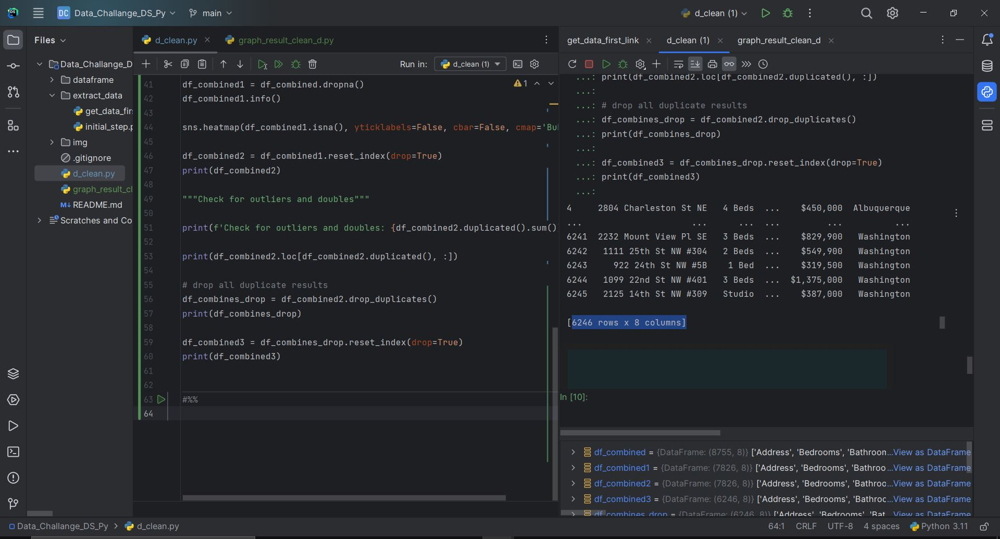

#### Fig.3 Check missing data and Matplotlib representation
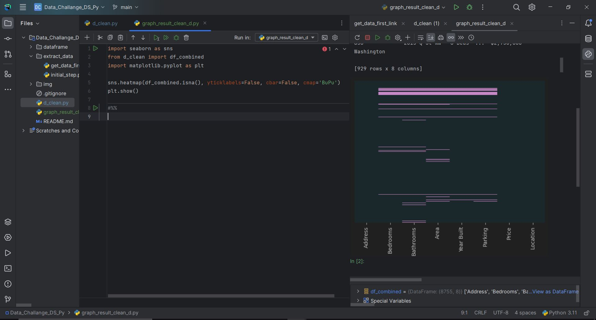

#### Fig.4 Verify count of parking places
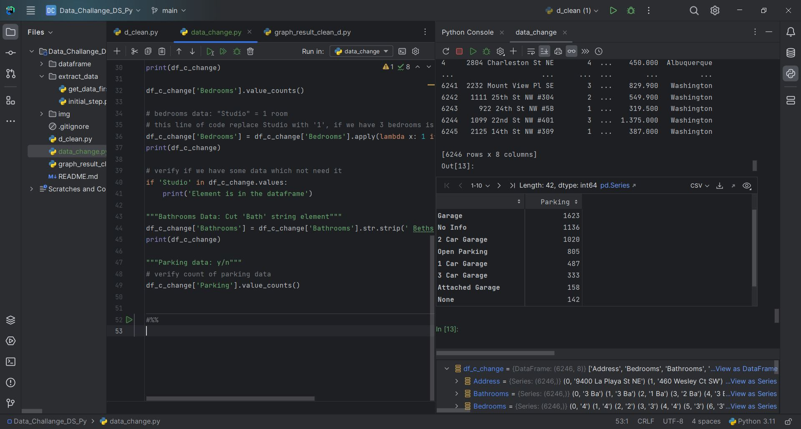

#### Fig.5 Verify parking places [ yes || no ]
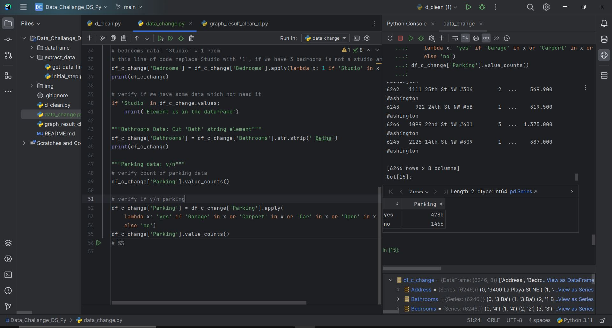

#### Fig.6 Final result of parking places data analysis
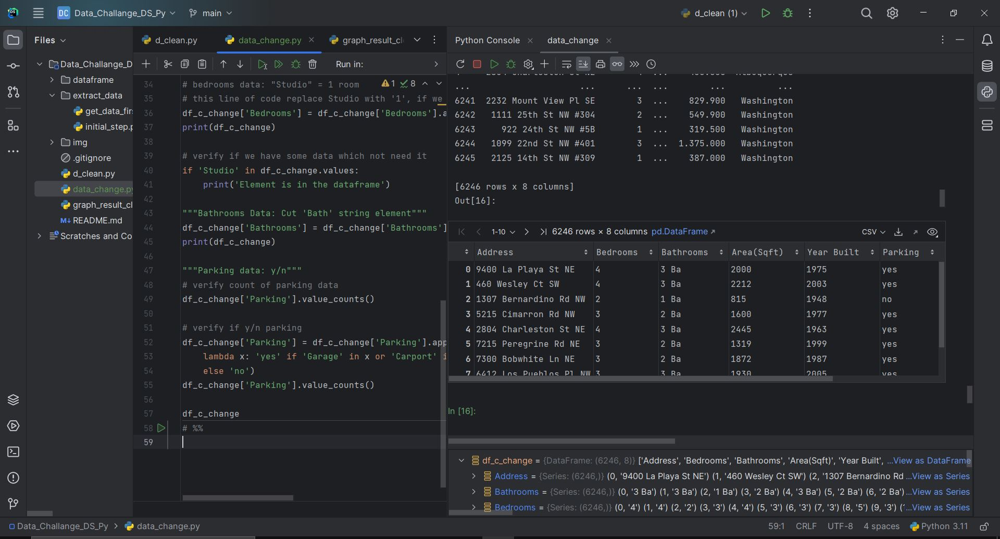

#### Fig.7 Data problems and statistics solution
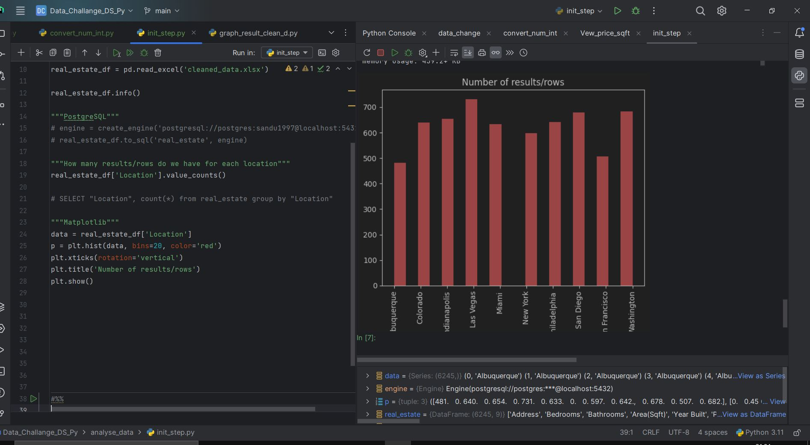
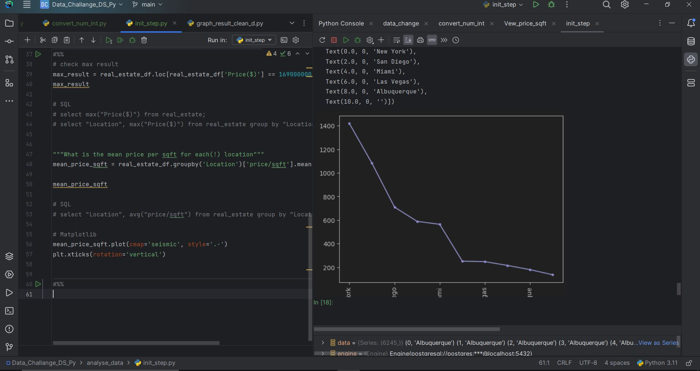

### PostgreSQL data extraction
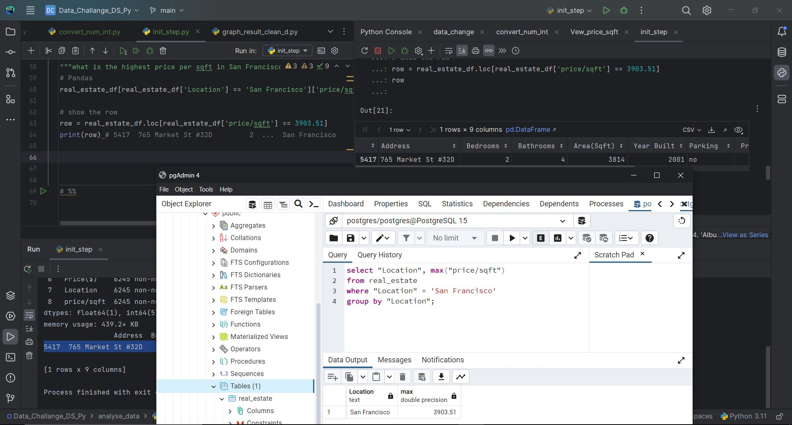

### PostgreSQL maximum price 
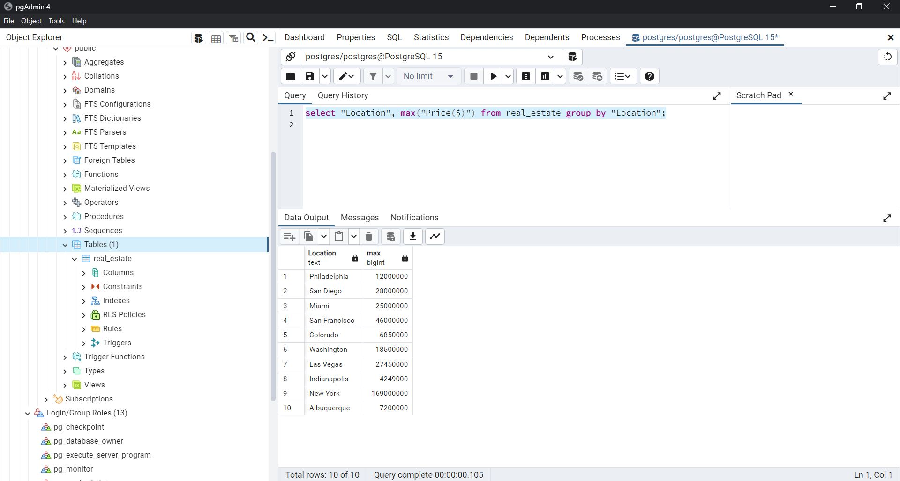

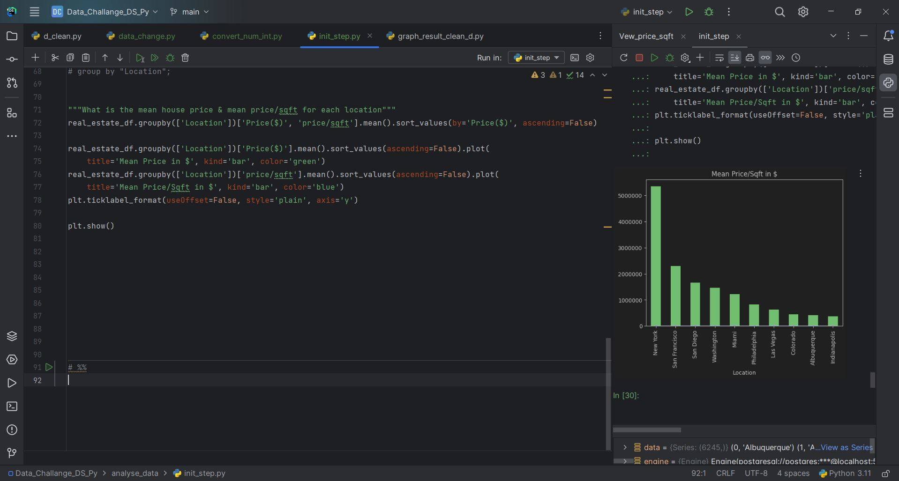

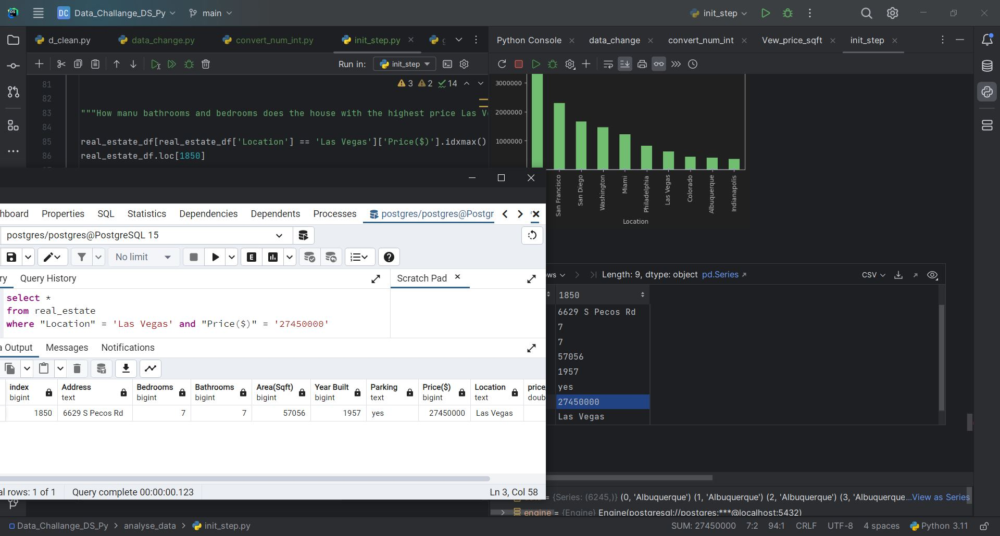

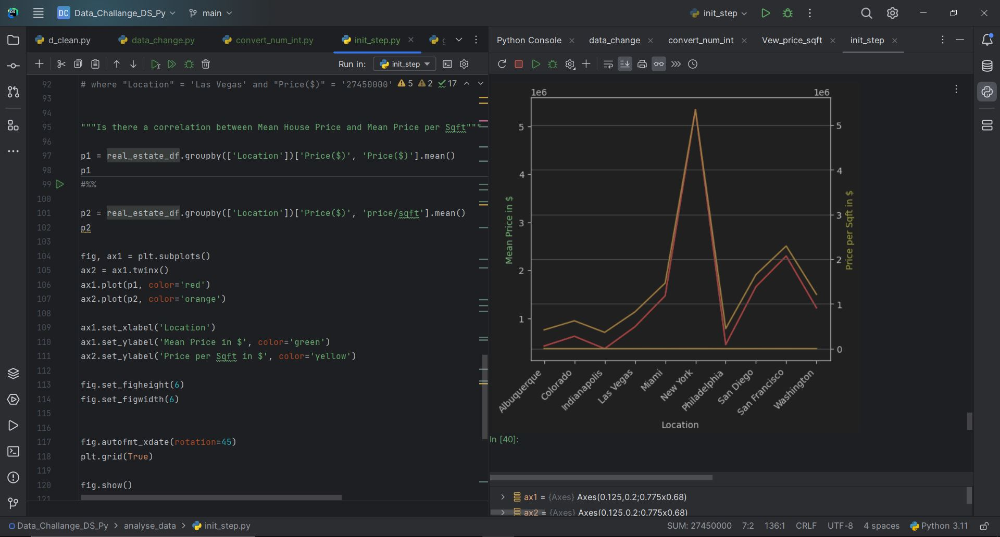